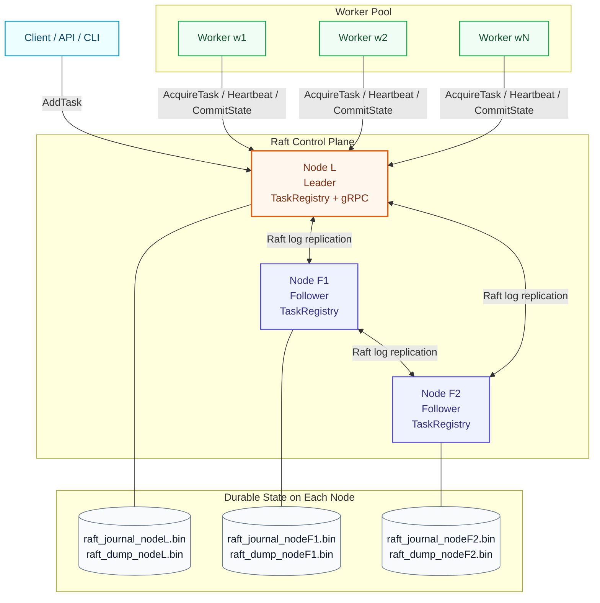

# Agent-Sentinel

High-availability task orchestration with a Raft-backed control plane, gRPC worker coordination, lease fencing, and checkpoint-based recovery.

## What This Project Is

Agent-Sentinel is a distributed orchestrator prototype that focuses on reliability primitives for agent-like workflows:

- leader-elected control plane (Raft via `pysyncobj`)
- replicated task registry
- worker leasing + heartbeats
- strict fencing tokens to reject stale workers
- checkpoint commit/replay for crash recovery
- poison-pill retries (`MAX_RETRIES`)

Current step pipeline in worker runtime:

1. `SEARCH`
2. `SUMMARIZE`
3. `SAVE`

## Architecture



### Runtime Model

- Each node runs `ControlPlaneNode` + `TaskRegistry` (replicated `ReplDict`).
- Only the current leader serves gRPC (`GrpcServerManager` starts/stops with leadership).
- Workers are stateless. Durable state lives in `checkpoint_json` inside replicated task records.
- Leader lease sweeper reverts orphaned `RUNNING` tasks to `PENDING` (or `FAILED` after retry limit).

## Repository Structure

- `agent_sentinel/control_plane/`
  - `node.py`: Raft node lifecycle + lease sweep loop
  - `registry.py`: replicated task mutations/reads, fencing, retries
  - `server.py`: process entrypoint for each node
- `agent_sentinel/grpc_layer/`
  - `protos/sentinel.proto`: service and message contracts
  - `servicer.py`: RPC handlers (`AddTask`, `AcquireTask`, `SendHeartbeat`, `CommitState`)
  - `server.py`: leader-gated gRPC server manager
- `agent_sentinel/workers/`
  - `worker.py`: stateless worker execution loop
  - `checkpoint.py`: `AgentState` schema + transition helpers
- `scripts/`
  - `compile_proto.sh`: regenerate gRPC stubs
  - `start_cluster.sh`: prints cluster start commands
  - `fault_tolerance_test.py`: leader failover + data durability test
  - `worker_test.py`: crash/recovery worker flow test
- `tests/`: unit tests

## Prerequisites

- Python 3.10+
- macOS/Linux shell

## Setup

```bash
python -m venv .venv
source .venv/bin/activate
pip install -r requirements.txt
```

Compile protobuf stubs if you change `sentinel.proto`:

```bash
./scripts/compile_proto.sh
```

## Run the Cluster

Terminal 1:

```bash
source .venv/bin/activate
python -m agent_sentinel.control_plane.server --node 0
```

Terminal 2:

```bash
source .venv/bin/activate
python -m agent_sentinel.control_plane.server --node 1
```

Terminal 3:

```bash
source .venv/bin/activate
python -m agent_sentinel.control_plane.server --node 2
```

Start one or more workers (new terminal):

```bash
source .venv/bin/activate
python -m agent_sentinel.workers.worker --worker-id w1
```

## Run Tests / Scenarios

Fault tolerance (leader failover):

```bash
source .venv/bin/activate
python scripts/fault_tolerance_test.py
```

Worker crash + checkpoint resume:

```bash
source .venv/bin/activate
python scripts/worker_test.py
```

Unit tests:

```bash
source .venv/bin/activate
pytest -q
```

## Data and Persistence

Raft state is persisted under `data/`:

- `raft_journal_node*.bin`
- `raft_dump_node*.bin`

Task state is in-memory on each node but replicated/durable through the Raft journal + dumps.

## Core Reliability Guarantees

- **Leader-only writes**: followers reject write RPCs (`NOT_LEADER`).
- **Fencing token**: stale workers cannot heartbeat/commit once token changes.
- **Checkpoint recovery**: new worker resumes from last committed `AgentState`.
- **Lease timeout recovery**: orphaned tasks are automatically re-queued (or failed after max retries).

## Configuration

Key settings live in [`agent_sentinel/config.py`](/Users/shruthymoorthy/Documents/GitHub/Agent-Sentinel/agent_sentinel/config.py):

- cluster addresses (`NODES`)
- lease/heartbeat timings
- retry threshold (`MAX_RETRIES`)
- gRPC base port (`GRPC_PORT_BASE`)

## Roadmap (Next)

- LangGraph-backed execution engine for step runtime
- HTTP API + UI for task submission and cluster monitoring
- external result persistence and observability stack
- sharding/batching for high-throughput scaling
